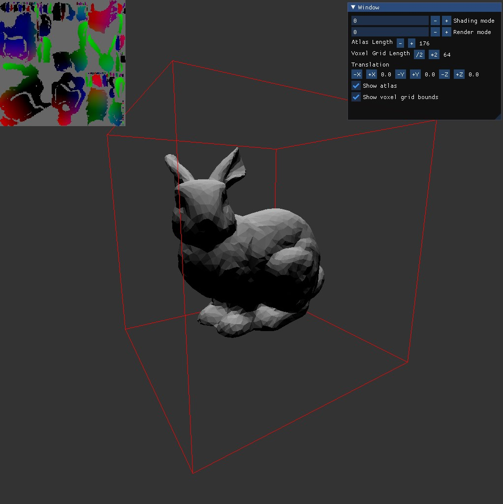
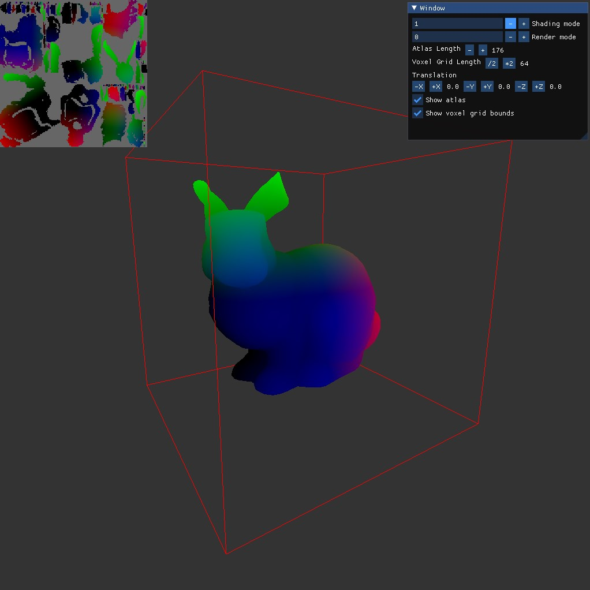
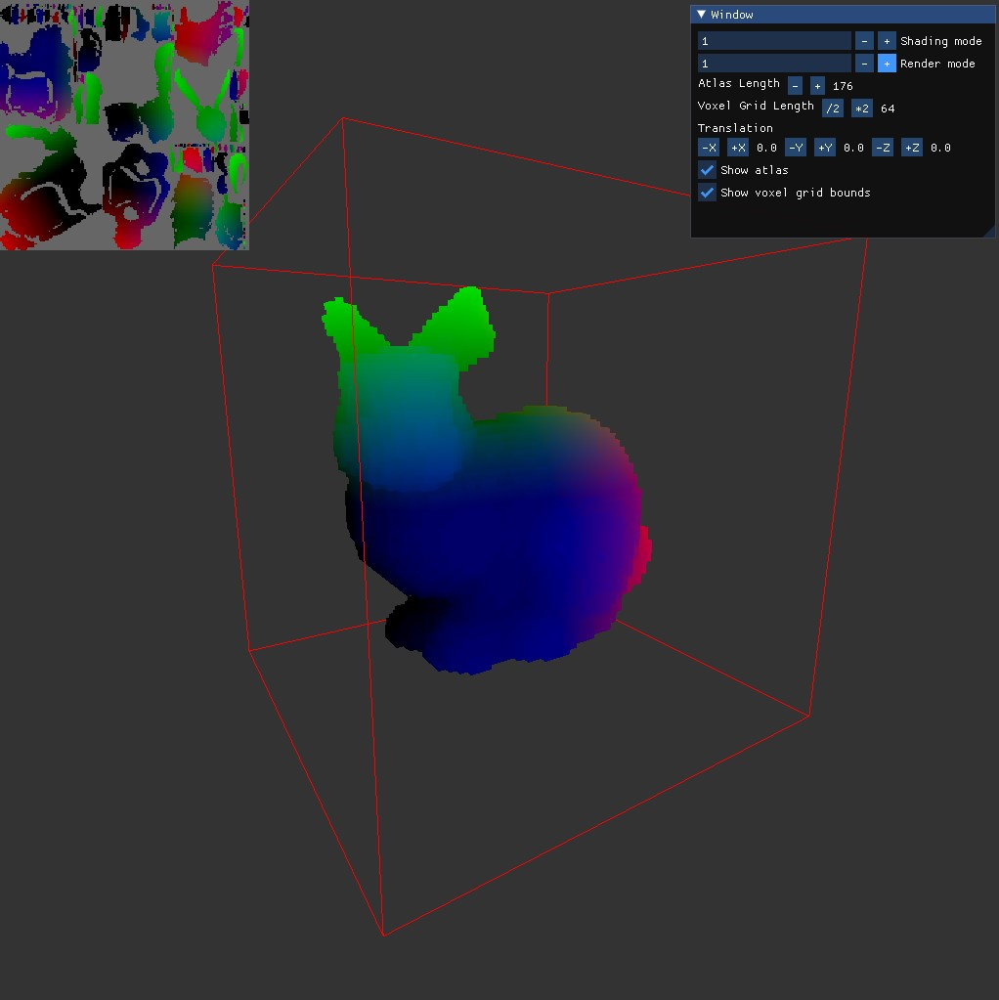
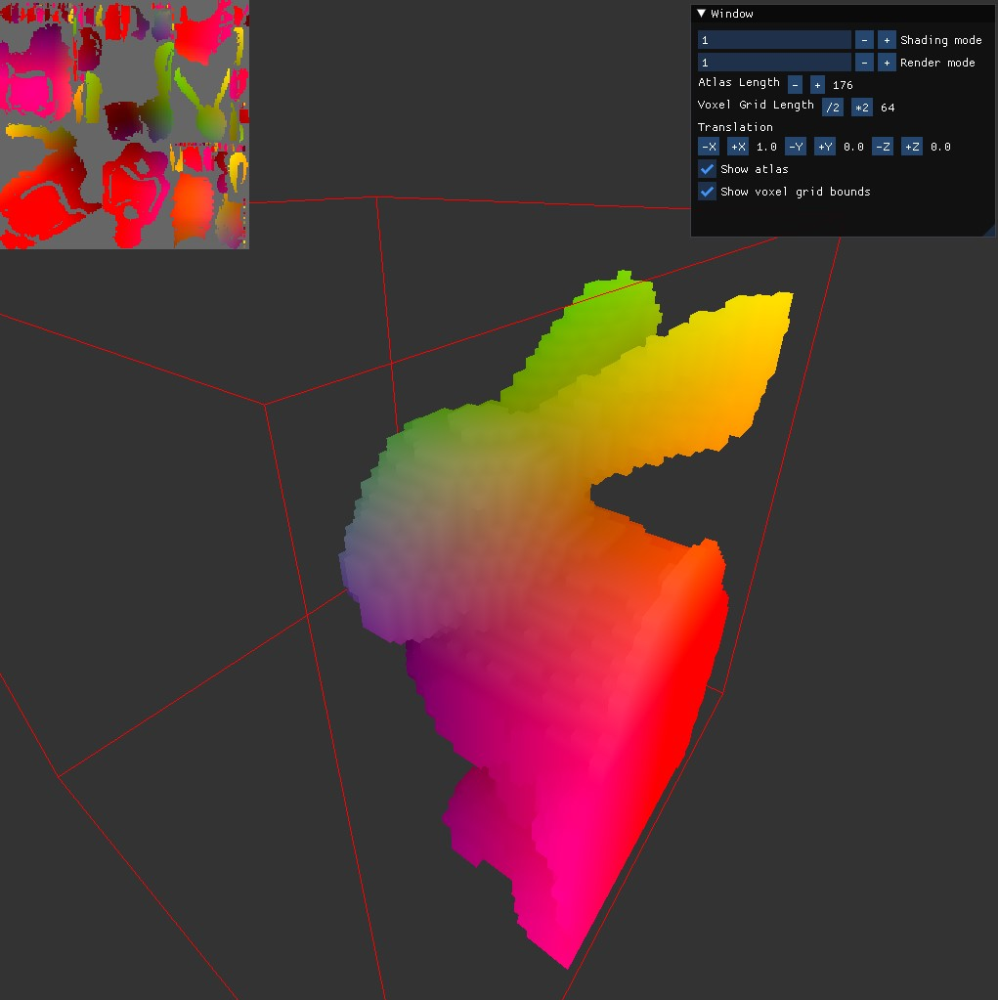

# Voxel-based global illumination demo

Implementation of an atlas-based boundary voxelization [1].

## Controls

`W - Move forward`

`A - Move left`

`S - Move backward`

`D - Move right`

`R - Move up`

`F - Move down`

`Click and drag mouse - Pan camera`

## User Interface

`Shading mode 0: Diffuse lighting`

`Shading mode 1: World position to color`

`Render mode 0: Mesh rendering`

`Render mode 1: Voxel rendering`

`Atlas length: Side length in texels of the texture atlas`

`Voxel grid length: How many voxels make up each side of the voxelized world region`

`Translation: Move the mesh along the x, y, and z axis`

`Show atlas: Whether or not to display the texture atlas`

`Show voxel grid bounds: Whether or not to show the bounds of the voxelized world region`

## Screenshots

## References

[1] Thiedemann, S., Henrich, N., Grosch, T., and Müller, S. 2011. Voxel-based global illumination. Symposium on Interactive 3D Graphics and Games.
